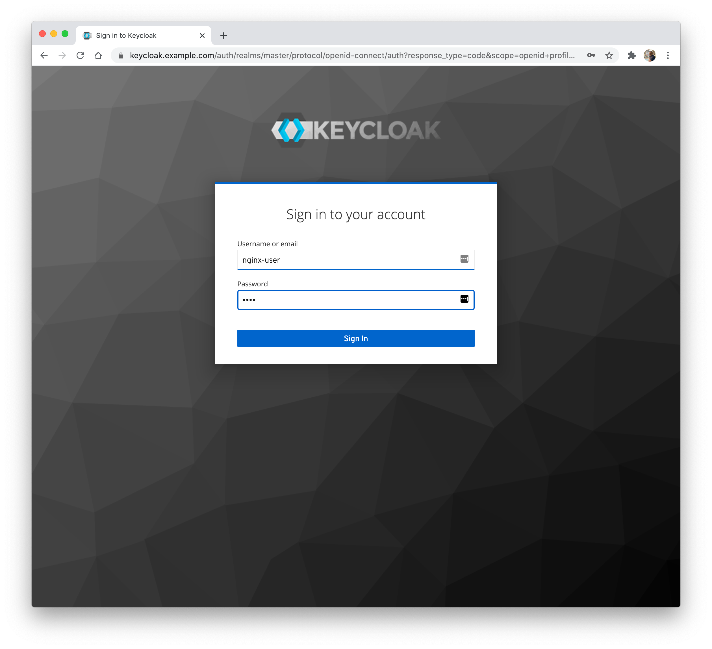
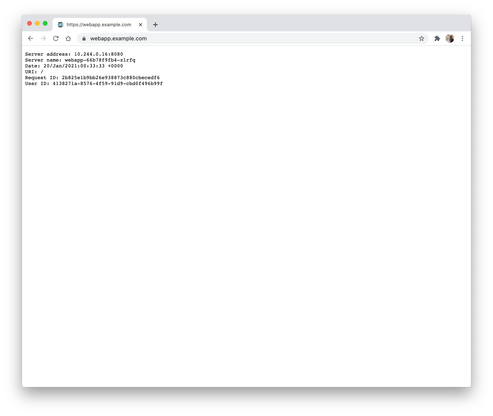

# OIDC with Front Channel Logout

In this example, we deploy two web applications, configure load balancing for them via VirtualServers, and protect the
applications using an [OIDC Policies](https://docs.nginx.com/nginx-ingress-controller/configuration/policy-resource/#oidc) and [Keycloak](https://www.keycloak.org/), and ensure behaviour is consistent across multiple replicas by enabling [Zone Synchronization](https://docs.nginx.com/nginx/admin-guide/high-availability/zone_sync/).

**Note**: The KeyCloak container does not support IPv6 environments.

**Note**: This example assumes that your default namespace is set to `default`. You can check this with

```shell
kubectl config view --minify | grep namespace
```

If it's not empty, and anything other than `default`, you can set to `default` with the following command:

```shell
kubectl config set-context --namespace default --current
```

## Prerequisites

1. Follow the [installation](https://docs.nginx.com/nginx-ingress-controller/installation/installation-with-manifests/)
   instructions to deploy NGINX Ingress Controller. This example requires that the HTTPS port of the Ingress
   Controller is `443`.
2. Save the public IP address of the Ingress Controller into `/etc/hosts` of your machine:

    ```text
    ...

    XXX.YYY.ZZZ.III fclo-one.example.com
    XXX.YYY.ZZZ.III fclo-two.example.com
    XXX.YYY.ZZZ.III keycloak.example.com
    ```

    Here `fclo-one.example.com` and `fclo-two.example.com` are the domains for the two web applications protected by OIDC authentication, and `keycloak.example.com` is the domain for the Keycloak IdP.

## Step 1 - Deploy a TLS Secret

Create a secret with the TLS certificate and key that will be used for TLS termination of the web applications and
Keycloak:

```shell
kubectl apply -f tls-secret.yaml
```

## Step 2 - Deploy a Web Application

Create the application deployments and services:

```shell
kubectl apply -f two-webapps.yaml
```

## Step 3 - Deploy Keycloak

1. Create the Keycloak deployment and service:

    ```shell
    kubectl apply -f keycloak.yaml
    ```

2. Create a VirtualServer resource for Keycloak:

    ```shell
    kubectl apply -f virtual-server-idp.yaml
    ```

## Step 4 - Configure Keycloak

To set up Keycloak follow the steps in the "Configuring Keycloak" [section of the documentation](keycloak_setup.md). That guide will get you to create a user, two OIDC clients, and save the client secrets in the necessary files.

## Step 5 - Deploy the Client Secrets

By this step, you should have encoded and edited both the `client-secret-one.yaml` and `client-secret-two.yaml` files. If you haven't, go back to the previous step.

Apply the secrets that will be used by the OIDC policies for the two virtual server:

```shell
kubectl apply -f client-secret-one.yaml
kubectl apply -f client-secret-two.yaml
```

## Step 6 - Configure Zone Synchronization and Resolver

In this step we configure:

- [Zone Synchronization](https://docs.nginx.com/nginx/admin-guide/high-availability/zone_sync/). For the OIDC feature to
  work when you have two or more replicas of the Ingress Controller, it is necessary to enable zone synchronization
  among the replicas. This is to ensure that each replica has access to the required session information when authenticating via IDP such as Keycloak.
- The resolver can resolve the host names.

Steps:

1. Apply the ConfigMap `nginx-config.yaml`, which contains `zone-sync` configuration parameter that enable zone synchronization and the resolver using the kube-dns service.

    ```shell
    kubectl apply -f nginx-config.yaml
    ```

## Step 7 - Deploy the OIDC Policies

Create policies with the names `oidc-one-policy` and `oidc-two-policy` that references the secrets from the previous step:

```shell
kubectl apply -f oidc-one.yaml
kubectl apply -f oidc-two.yaml
```

## Step 8 - Configure Load Balancing

Create VirtualServer resources for the web applications:

```shell
kubectl apply -f two-virtual-servers.yaml
```

Note that the VirtualServers reference the policies `oidc-one-policy` and `oidc-two-policy` created in Step 6.

## Step 9 - Test the Configuration

1. Open a web browser and navigate to the URL of one of the web applications: `https://fclo-one.example.com`. You will be
   redirected to Keycloak.
2. Log in with the username and password for the user you created in Keycloak, `nginx-user` and `test`.

3. Once logged in, you will be redirected to the web application and get a response from it. Notice the field `User ID`
in the response, this will match the ID for your user in Keycloak. 
4. If you then navigate to the URL of the other web application, `https://fclo-two.example.com`, you will already be authenticated, and you will see the same `User ID` on the page.

## Step 10 - Log Out

**Note:** As Front Channel Logout depends on an invisible iframe from keycloak that points to different domains, your browser's Content Security Policy will normally refuse to make the request. In order to make this work, you will need to install a browser extension that disables applying any CSP headers. This will lower your browser's protection, so please make sure to remove or disable the extension as soon as you're done with the test.

1. To log out, navigate to `https://fclo-one.example.com/logout`. Your session will be terminated, and you will be
   redirected to the default post logout URI `https://fclo-one.example.com/_logout`.
. You can also initiate this logout from the other webapp as well
2. To confirm that you have been logged out, navigate to `https://fclo-one.example.com` or `https://fclo-two.example.com`. You will be redirected to Keycloak to log in again.
3. To confirm that front channel logout was responsible for this, you can look at the `nginx-ingress` pod's logs. You should look for the following two lines:

   ```text
   OIDC Front-Channel Logout initiated for sid: <uuid v4>
   GET /front_channel_logout?sid=<uuid v4>
   ```

   These should show up twice, once for each client.
