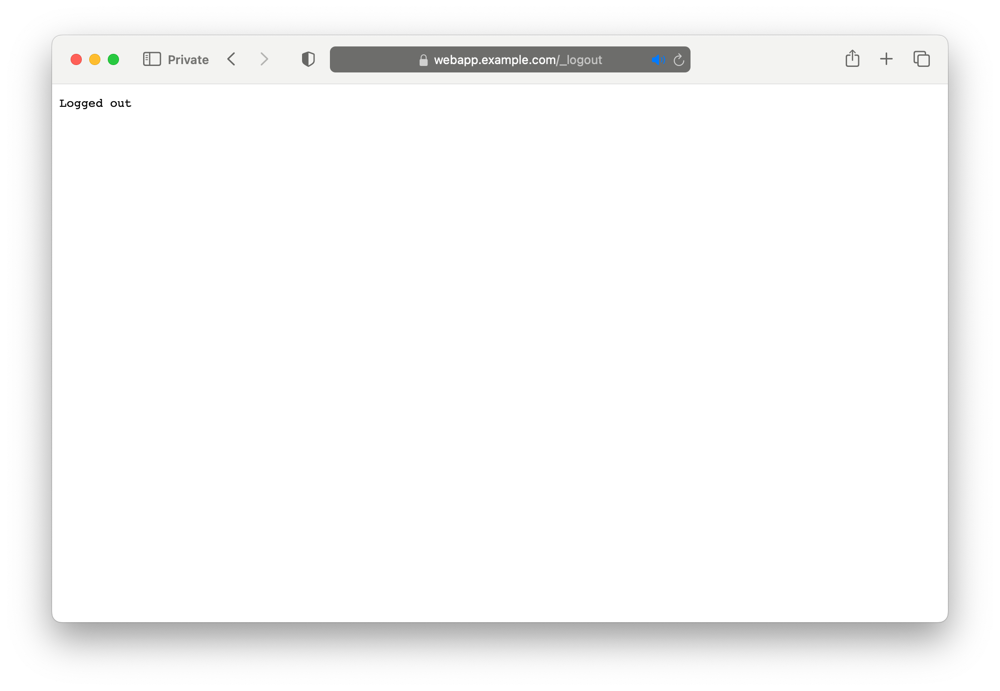

# OIDC

In this example, we deploy a web application, configure load balancing for it via a VirtualServer, and protect the
application using an OpenID Connect policy and [Keycloak](https://www.keycloak.org/), and ensure behaviour is consistent across multiple replicas by enabling [Zone Synchronization](https://docs.nginx.com/nginx/admin-guide/high-availability/zone_sync/).

**Note**: The KeyCloak container does not support IPv6 environments.

**Note**: This example assumes that your default namespace is set to `default`. You can check this with

```shell
kubectl config view --minify | grep namespace
```

If it's not empty, and anything other than `default`, you can set to `default` with the following command:

```shell
kubectl config set-context --namespace default --current
```

## Prerequisites

1. Follow the [installation](https://docs.nginx.com/nginx-ingress-controller/installation/installation-with-manifests/)
   instructions to deploy NGINX Ingress Controller. This example requires that the HTTPS port of the Ingress
   Controller is `443`.
2. Save the public IP address of the Ingress Controller into `/etc/hosts` of your machine:

    ```text
    ...

    XXX.YYY.ZZZ.III webapp.example.com
    XXX.YYY.ZZZ.III keycloak.example.com
    ```

    Here `webapp.example.com` is the domain for the web application and `keycloak.example.com` is the domain for
    Keycloak.

## Step 1 - Deploy a TLS Secret

Create a secret with the TLS certificate and key that will be used for TLS termination of the web application and
Keycloak:

```shell
kubectl apply -f tls-secret.yaml
```

## Step 2 - Deploy a Web Application

Create the application deployment and service:

```shell
kubectl apply -f webapp.yaml
```

## Step 3 - Deploy Keycloak

1. Create the Keycloak deployment and service:

    ```shell
    kubectl apply -f keycloak.yaml
    ```

2. Create a VirtualServer resource for Keycloak:

    ```shell
    kubectl apply -f virtual-server-idp.yaml
    ```

## Step 4 - Configure Keycloak

To set up Keycloak:

1. Follow the steps in the "Configuring Keycloak" [section of the documentation](https://docs.nginx.com/nginx/deployment-guides/single-sign-on/keycloak/#configuring-keycloak):
    1. To connect to Keycloak, use `https://keycloak.example.com`.
    2. Make sure to save the client secret for NGINX-Plus client to the `SECRET` shell variable:

        ```shell
        SECRET=value
        ```

2. Alternatively, [execute the commands](./keycloak_setup.md).

## Step 5 - Deploy the Client Secret

**Note**: If you're using PKCE, skip this step. PKCE clients do not have client secrets. Applying this will result
in a broken deployment.

1. Encode the secret, obtained in the previous step:

    ```shell
    echo -n $SECRET | base64
    ```

2. Edit `client-secret.yaml`, replacing `<insert-secret-here>` with the encoded secret.

3. Create a secret with the name `oidc-secret` that will be used by the OIDC policy:

    ```shell
    kubectl apply -f client-secret.yaml
    ```

## Step 6 - Configure Zone Synchronization and Resolver

In this step we configure:

- [Zone Synchronization](https://docs.nginx.com/nginx/admin-guide/high-availability/zone_sync/). For the OIDC feature to
  work when you have two or more replicas of the Ingress Controller, it is necessary to enable zone synchronization
  among the replicas. This is to ensure that each replica has access to the required session information when authenticating via IDP such as Keycloak.
- The resolver can resolve the host names.

Steps:

1. Apply the ConfigMap `nginx-config.yaml`, which contains `zone-sync` configuration parameter that enable zone synchronization and the resolver using the kube-dns service.

    ```shell
    kubectl apply -f nginx-config.yaml
    ```

## Step 7 - Deploy the OIDC Policy

Create a policy with the name `oidc-policy` that references the secret from the previous step:

```shell
kubectl apply -f oidc.yaml
```

## Step 8 - Configure Load Balancing

Create a VirtualServer resource for the web application:

```shell
kubectl apply -f virtual-server.yaml
```

Note that the VirtualServer references the policy `oidc-policy` created in Step 6.

## Step 9 - Test the Configuration

1. Open a web browser and navigate to the URL of the web application: `https://webapp.example.com`. You will be
   redirected to Keycloak.
2. Log in with the username and password for the user you created in Keycloak, `nginx-user` and `test`.

3. Once logged in, you will be redirected to the web application and get a response from it. Notice the field `User ID`
in the response, this will match the ID for your user in Keycloak. 

## Step 10 - Log Out

1. To log out, navigate to `https://webapp.example.com/logout`. Your session will be terminated, and you will be
   redirected to the default post logout URI `https://webapp.example.com/_logout`.

2. To confirm that you have been logged out, navigate to `https://webapp.example.com`. You will be redirected to
   Keycloak to log in again.
